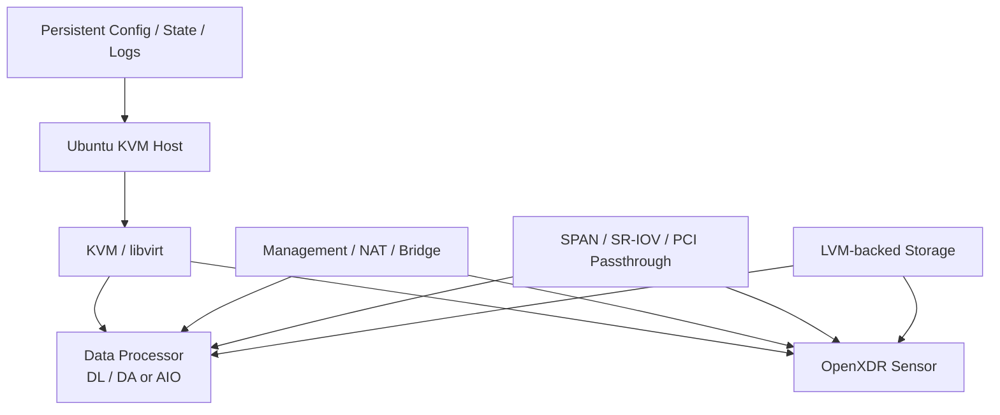

# 아키텍처

OpenXDR KVM Installer는 범용 Ubuntu Server를 반복 가능한 OpenXDR KVM 배포 Platform으로 구성합니다.

## 구성 계층

### Host
CPU, Memory, Disk, NIC, Kernel Feature와 Virtualization Capability를 제공합니다.

### KVM / libvirt
OpenXDR VM을 실행하는 Virtualization Layer를 Installer가 설치하거나 구성합니다.

### Storage
선택한 Installer와 Topology에 맞춰 LVM 기반 Storage를 준비합니다.

### Networking
Host Management, NAT/Bridge 기반 VM Network, DP Data Path, Sensor SPAN, SR-IOV/PCI Passthrough가 필요에 따라 구성됩니다.

### Lifecycle State
Persistent Configuration, State, Log를 통해 Reboot 후 Resume와 Step 단위 Retry가 가능합니다.
