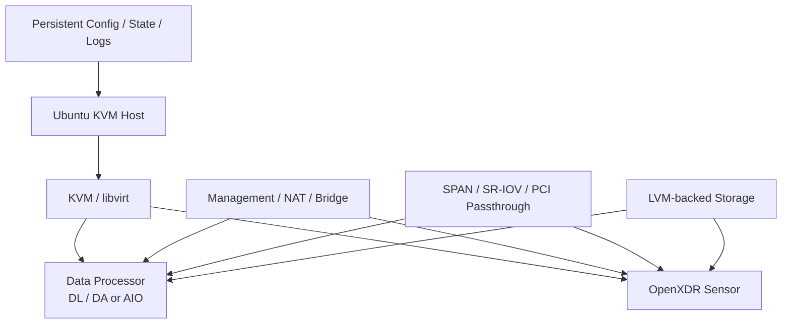

# 아키텍처

OpenXDR KVM Installer는 일반 Ubuntu Server를 OpenXDR KVM 배포용 호스트로 구성합니다.

```mermaid
flowchart TB
    H["Ubuntu KVM Host"] --> K["KVM / libvirt"]
    K --> DP["Data Processor<br/>DL / DA or AIO"]
    K --> S["OpenXDR Sensor"]
    N["Management / NAT / Bridge"] --> DP
    N --> S
    P["SPAN / SR-IOV / PCI Passthrough"] --> S
    P --> DP
    L["LVM-backed Storage"] --> DP
    L --> S
    C["Persistent Config / State / Logs"] --> H
```

## 구성 계층

### Host
CPU, Memory, Disk, NIC, Kernel Feature와 Virtualization Capability를 제공합니다.

### KVM / libvirt
설치 프로그램이 OpenXDR VM을 실행하는 가상화 환경을 설치하거나 구성합니다.

### Storage
선택한 설치 유형과 토폴로지에 맞춰 LVM 기반 스토리지를 준비합니다.

### Networking
호스트 관리, NAT/Bridge 기반 VM 네트워크, DP 데이터 경로, Sensor SPAN, SR-IOV/PCI Passthrough를 필요에 따라 구성합니다.

### Lifecycle State
저장된 설정, 작업 상태, 로그를 이용해 재부팅 후 이어서 실행하거나 실패한 단계만 다시 시도할 수 있습니다.
