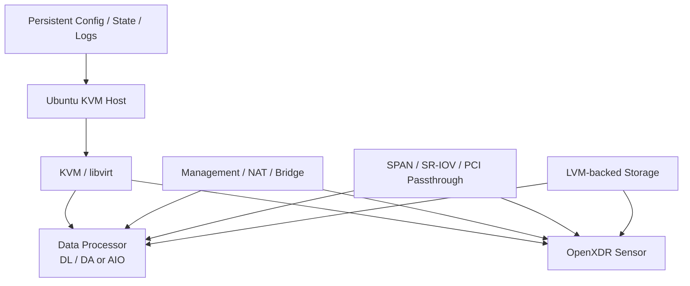

# Architecture

The project turns a general-purpose Ubuntu server into a repeatable OpenXDR KVM deployment platform.

## Layers

### Host
The Ubuntu host provides CPU, memory, disks, NICs, kernel features and virtualization capabilities.

### KVM / libvirt
The installer creates or configures the virtualization layer used to run OpenXDR VMs.

### Storage
LVM-backed volumes are prepared according to the selected installer and component topology.

### Networking
The deployment can include host management, libvirt/NAT or bridge connectivity, DP data connectivity, Sensor SPAN interfaces, and direct device assignment where required.

### Lifecycle state
Persistent configuration, state and logs allow deployment to pause for reboot, resume, and retry individual steps.
